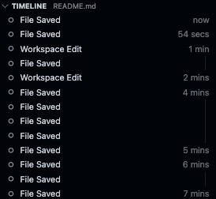

# Demo of some Visual Studio Code (VS Code) Features

**Note:** when keyboard shortcuts are provided, they are based on my current settings on a Mac, and may not be the default settings. You can customize your own according to your preference.

- [Demo of some Visual Studio Code (VS Code) Features](#demo-of-some-visual-studio-code-vs-code-features)
  - [File Agnostic](#file-agnostic)
    - [File-Agnostic Features](#file-agnostic-features)
    - [File-Agnostic Extensions](#file-agnostic-extensions)
    - [File-Agnostic Links](#file-agnostic-links)
  - [Snowflake](#snowflake)
    - [Snowflake Extensions](#snowflake-extensions)
    - [Snowflake Features](#snowflake-features)
  - [Dataiku](#dataiku)
  - [CSV Files](#csv-files)
    - [`.csv`-File Extensions](#csv-file-extensions)
  - [Python projects](#python-projects)
    - [Python-Project Features](#python-project-features)
    - [Python-Project Extensions](#python-project-extensions)
  - [`.json` Files](#json-files)
    - [`.json`-File Features](#json-file-features)
    - [`.json`-File Extensions](#json-file-extensions)
  - [Markdown](#markdown)
    - [Markdown Extensions](#markdown-extensions)
    - [Markdown Features](#markdown-features)
    - [Commands](#commands)
    - [Markdown Links](#markdown-links)
  - [Draw.io Files](#drawio-files)
  - [Shell Files](#shell-files)
    - [Shell-File Features](#shell-file-features)
  - [R Projects](#r-projects)
  - [Other Extensions Not Described in Detail Here](#other-extensions-not-described-in-detail-here)
  - [Other Links for Further Learning](#other-links-for-further-learning)

## File Agnostic

This section describes VS Code uses that are agnostic to the file type being edited.

### File-Agnostic Features

- Autosave
- Format on type
- Format on save
- Fix on save
- Creation of opening and closing punctuation: (e.g., ```''""()[]{}```)
  - Wrap selected text in opening-and-closing punctuation
- Search entire directory, including auto-complete and recently opened suggestions (`command + shift + f`)


- Replace in entire directory (`command + shift + h`)
- Highlight all instances (click on a token)


- Select next instance (`command d`)
- Open file in directory (`command p`)
- Multi-cursor (`alt + click` or `alt + command + down/up arrow`)


- Themes including light, dark, and colorblind-friendly (`command k` then `command t`)


- Problems (`command+shift+m`) and quick-fix suggestions (`command + .`)


- Toggle Comment multiline (`command /`)
- Explorer view (`command+shift+e`)
  - Open editors

  
  
  - Workspace file structure
  
  
  
  - Outline
  
  
  
  - Timeline
  
  

- Section collapsing


- Terminal integration including multiple terminal groups and panes


- Huge selection of extensions (`command+shift+x`)


### File-Agnostic Extensions

- Code Spell Checker
  - Lints when a word is not in the dictionary:
  
  
  
  - Allows you to fix or add custom words to your dictionary with quick-fix suggestions
  
  
  
  - Also available for several other languages including Swedish, German, and a special 'Medical Terminology' dictionary
- Git including GUI-based repository management, branch management, commit history, pull-request management, version compare
  - [GitLens - Git supercharged](https://marketplace.visualstudio.com/items?itemName=eamodio.gitlens)
  - [Git History](https://marketplace.visualstudio.com/items?itemName=donjayamanne.githistory)
  - [Git Project Manager](https://marketplace.visualstudio.com/items?itemName=felipecaputo.git-project-manager)
  - [GitHub Actions](https://marketplace.visualstudio.com/items?itemName=GitHub.vscode-github-actions)
  - [GitHub Pull Requests and Issues](https://marketplace.visualstudio.com/items?itemName=GitHub.vscode-pull-request-github)
  
  
  
  
  
  
- [VSCode Neovim](https://marketplace.visualstudio.com/items?itemName=asvetliakov.vscode-neovim)

### File-Agnostic Links

- [Basic Editing](https://code.visualstudio.com/docs/editor/codebasics#:~:text=VS%20Code%20allows%20you%20to%20quickly%20search%20over%20all%20files,and%20enter%20your%20search%20term.)

## Snowflake

This section describes VS Code uses with our Snowflake data lake.

### Snowflake Extensions

- [Snowflake](https://marketplace.visualstudio.com/items?itemName=snowflake.snowflake-vsc)
- [sqlfluff](https://marketplace.visualstudio.com/items?itemName=dorzey.vscode-sqlfluff)

### Snowflake Features

- Single Sign On
- Object Explorer including Databases and drill down to metadata
- Query History including click to rerun and click to copy
- Query Editor
  - Syntax highlighting
  - Linting hints and quick fixes
  - Formatting with `sqlfluff`
  - Hover for hints and link to Snowflake documentation
  - Execute queries (`command+enter`)
    - Multiple views after execution including information pane, ability to save results locally and opening results in new tab

## Dataiku

This section describes VS Code uses with Dataiku platform.

## CSV Files

This section describes VS Code uses with `.csv` files.

### `.csv`-File Extensions

- Edit csv
- Rainbow csv

## Python projects

This section describes VS Code uses with `python` projects.

### Python-Project Features

- Formatting
- Linting
- Debugging
- Function, class, method hints
- Token-replacement
- Automatic imports

### Python-Project Extensions

- Black formatter
- isort
- pylint
- python
- pylance
- jupyter
- jupyter keymap
- jupyter cell tags
- jupyter slideshow
- autodocstring
- intellicode-api-usage-examples

## `.json` Files

This section describes VS Code uses with `.json` files.

### `.json`-File Features

- Linting
- Sorting

### `.json`-File Extensions

- sort json
- json lint

## Markdown

This section describes VS Code uses that are with Markdown files.

### Markdown Extensions

- [Markdown All in One](https://marketplace.visualstudio.com/items?itemName=yzhang.markdown-all-in-one)
- [Markdown PDF](https://marketplace.visualstudio.com/items?itemName=yzane.markdown-pdf)
- [Markdown Preview Enhanced](https://marketplace.visualstudio.com/items?itemName=shd101wyy.markdown-preview-enhanced)
- [markdownlint](https://marketplace.visualstudio.com/items?itemName=DavidAnson.vscode-markdownlint)

### Markdown Features

- Table of contents creation and updating (`command+t` then `c`)
- Auto-list creation
- Embedding of pictures (drag from Explorer view, hold `shift`, release drag)

### Commands

- `command + k` then `v` to view preview
- `command + shift + p` then search 'Markdown' for extension commands such as exporting to pdf
- `command t` then `c` create table of contents

### Markdown Links

- [Markdown syntax](https://www.markdownguide.org/basic-syntax/)

## Draw.io Files

This section describes VS Code uses with `draw.io` files.

## Shell Files

This section describes VS Code uses with `sh` files.

### Shell-File Features

- Intellisense hints, linting, linking to documentation

## R Projects

This section describes VS Code uses with `R` projects.

## Other Extensions Not Described in Detail Here

- todo tree
- filesize
- Docker
- remote containers
- remote ssh
- remote-explorer
- remote-server
- yaml
- vscode-icons

## Other Links for Further Learning

- [Getting started with Visual Studio Code](https://code.visualstudio.com/docs/introvideos/basics)
- [Visual Studio Code Youtube channel](https://www.youtube.com/@code)
- [Python in Visual Studio Code](https://code.visualstudio.com/docs/languages/python)
- [TypeScript in Visual Studio Code](https://code.visualstudio.com/docs/languages/typescript)
