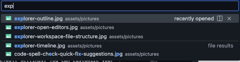
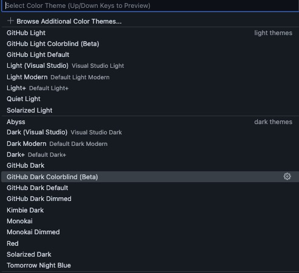
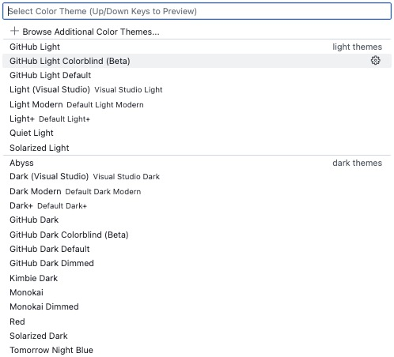
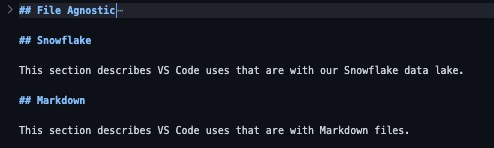
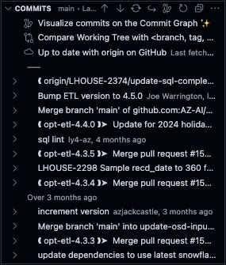
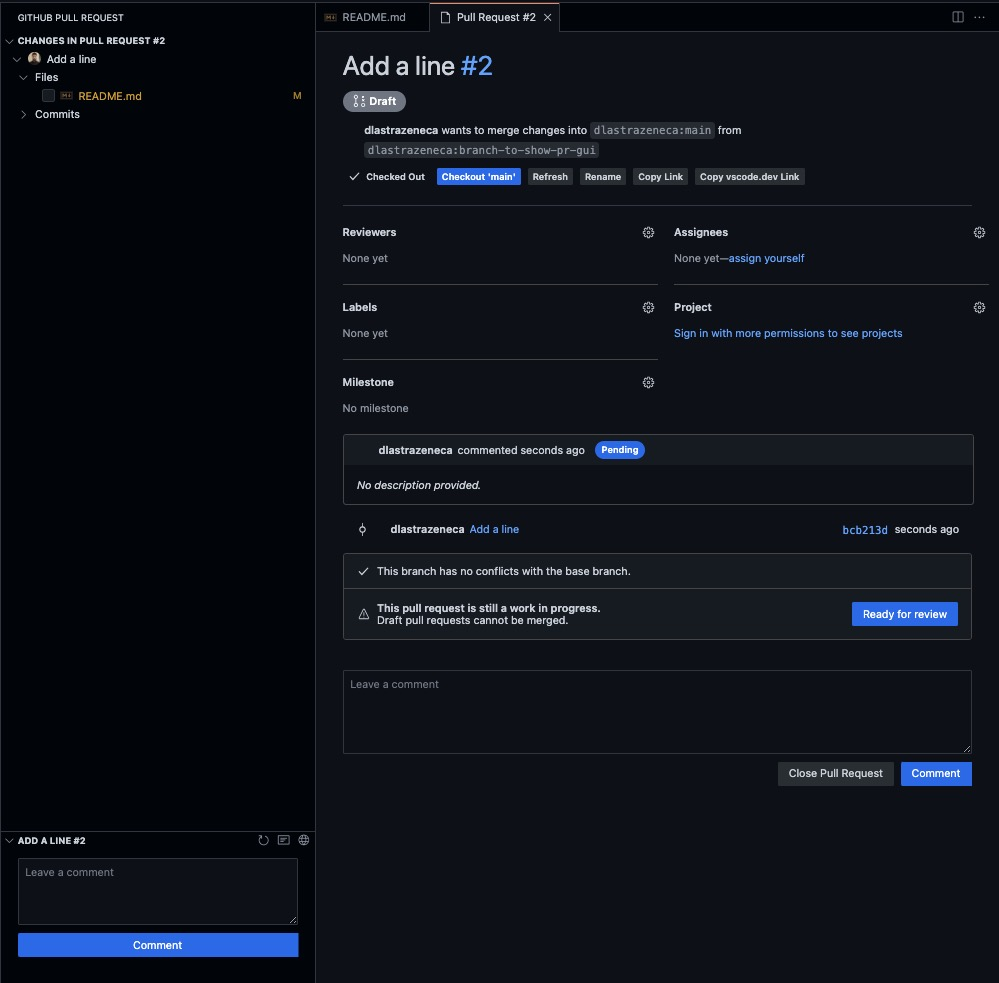

# File Agnostic

This document describes VS Code uses that are agnostic to the file type being edited.

## File-Agnostic Features

- Autosave
- Format on type
- Format on save
- Fix on save
- Creation of opening and closing punctuation: (e.g., ```''""()[]{}```)
  - Wrap selected text in opening-and-closing punctuation
- Search entire directory, including auto-complete and recently opened suggestions (`command + shift + f`)



- Replace in entire directory (`command + shift + h`)
- Highlight all instances (click on a token)


- Select next instance (`command d`)
- Open file in directory (`command p`)
- Multi-cursor (`alt + click` or `alt + command + down/up arrow`)


- Themes including light, dark, and colorblind-friendly (`command k` then `command t`)




- Problems (`command+shift+m`) and quick-fix suggestions (`command + .`)


- Toggle Comment multiline (`command /`)
- Explorer view (`command+shift+e`)
  - Open editors

  
  
  - Workspace file structure
  
  
  
  - Outline
  
  
  
  - Timeline
  
  

- Section collapsing




- Terminal integration including multiple terminal groups and panes


- Huge selection of extensions (`command+shift+x`)


## File-Agnostic Extensions

- Code Spell Checker
  - Lints when a word is not in the dictionary:
  
  
  
  - Allows you to fix or add custom words to your dictionary with quick-fix suggestions
  
  
  
  - Also available for several other languages including Swedish, German, and a special 'Medical Terminology' dictionary
- Git including GUI-based repository management, branch management, commit history, pull-request management, version compare
  - [GitLens - Git supercharged](https://marketplace.visualstudio.com/items?itemName=eamodio.gitlens)
  - [Git History](https://marketplace.visualstudio.com/items?itemName=donjayamanne.githistory)
  - [Git Project Manager](https://marketplace.visualstudio.com/items?itemName=felipecaputo.git-project-manager)
  - [GitHub Actions](https://marketplace.visualstudio.com/items?itemName=GitHub.vscode-github-actions)
  - [GitHub Pull Requests and Issues](https://marketplace.visualstudio.com/items?itemName=GitHub.vscode-pull-request-github)
  
  

  

  

  

  

- [VSCode Neovim](https://marketplace.visualstudio.com/items?itemName=asvetliakov.vscode-neovim)

## File-Agnostic Links

- [Basic Editing](https://code.visualstudio.com/docs/editor/codebasics#:~:text=VS%20Code%20allows%20you%20to%20quickly%20search%20over%20all%20files,and%20enter%20your%20search%20term.)
