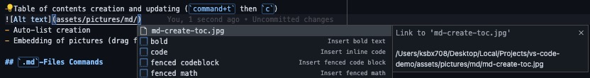

# `.md` Files

This section describes VS Code uses that are with Markdown files.

- [`.md` Files](#md-files)
  - [`.md`-Files Extensions](#md-files-extensions)
  - [`.md`-Files Features](#md-files-features)
  - [`.md`-Files Commands](#md-files-commands)
  - [`.md`-Files Links](#md-files-links)

## `.md`-Files Extensions

- [Markdown All in One](https://marketplace.visualstudio.com/items?itemName=yzhang.markdown-all-in-one)
- [Markdown PDF](https://marketplace.visualstudio.com/items?itemName=yzane.markdown-pdf)
- [Markdown Preview Enhanced](https://marketplace.visualstudio.com/items?itemName=shd101wyy.markdown-preview-enhanced)
- [markdownlint](https://marketplace.visualstudio.com/items?itemName=DavidAnson.vscode-markdownlint)

## `.md`-Files Features

- Table of contents creation and updating (`command+t` then `c`)

- Automatic-list continuation with new lines
- Embedding of pictures (drag from Explorer view, hold `shift`, release drag)
- Auto-complete suggestions when linking files in the workspace

## `.md`-Files Commands

- `command + k` then `v` to view preview
- `command + shift + p` then search 'Markdown' for extension commands such as exporting to pdf
- `command t` then `c` create table of contents

## `.md`-Files Links

- [Markdown syntax](https://www.markdownguide.org/basic-syntax/)
